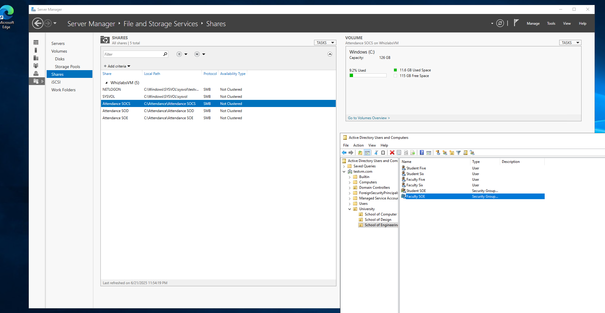
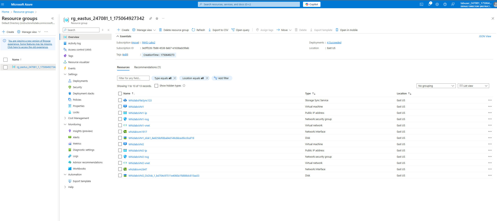
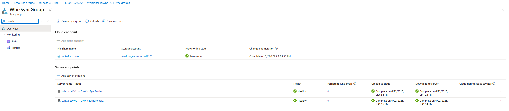

# Setup Shared Folders with NTFS Permissions in Windows Server – Whizlabs Lab Implementation

Type: Lab Project — Windows Server & Active Directory  
Skills: Active Directory, File Server, NTFS Permissions, Group Management

* * *

## Overview

This project replicates the **Whizlabs “Setup Shared Folders with NTFS Permissions in Windows Server”** lab.  
The lab covers deploying a Windows Server VM in Azure, promoting it to a Domain Controller, creating Active Directory structure (OUs, Users, Groups), and setting up a File Server with NTFS permissions for shared folders.

* * *

## Objectives

- Sign in to the **Azure Portal**
- Create an **Azure Virtual Machine**
- RDP into the VM
- Install **Active Directory Domain Services**
- Promote server to **Domain Controller**
- Configure **DNS**
- Create **Organizational Units (OUs)**
- Create **Users** and **Groups**
- Add users to groups
- Install **File Server Role**
- Create **Folders and Subfolders**
- Configure **NTFS Permissions** for shared folders
- Validate file sync and access

* * *

## What I Did

### 1) Provision Windows Server VM
- Created an Azure VM in East US.  
- Connected using RDP.

### 2) Configure Active Directory
- Installed **AD DS role** and promoted the server to a **Domain Controller**.  
- Configured **DNS** for the domain.  
- Created **OUs**, **Users**, and **Groups**.  
- Assigned users to groups for role-based access control.

### 3) Setup File Server
- Installed **File Server Role**.  
- Created folders and subfolders for shared access.  
- Configured **NTFS permissions** to control access (read, modify, full control).  
- Validated file access using domain user accounts.

* * *

## Screenshots

### File Permissions Configuration

### Resource Group with All Resources

### Validation of File Sync

* * *

## Next Steps (outside the lab)

- Configure **DFS Namespace** for distributed shares.  
- Enable **File Server Resource Manager (FSRM)** for quotas and classification.  
- Integrate file access logging with **Microsoft Sentinel** for auditing.  

* * *

## References

- Whizlabs – *Setup Shared Folders with NTFS Permissions in Windows Server*  
- [Microsoft Docs – Share and set NTFS permissions](https://learn.microsoft.com/en-us/troubleshoot/windows-server/networking/share-and-ntfs-permissions)
